Robocode bouw7 tournament
=========================

Robocode is een populair Java-framework waarbij zelf-geprogrammeerde robots het
tegen elkaar op nemen in een 2D-arena.

## 1. Installatie (IDE)

Hoewel Robocode zelf met een built-in Java-editor komt, voorziet deze je helaas
niet van code-completion en andere handige snufjes die een normale IDE je
geeft. Om het voor iedereen zo eerlijk en leuk mogelijk te houden, mag iedereen
een volwaardige IDE gebruiken.

In deze documentatie gebruiken we Jet-brains IntelliJ IDEA. Als je zelf al in
bezit bent van een Java-capable IDE, mag je die natuurlijk ook gewoon
gebruiken.

Ga naar https://www.jetbrains.com/idea/download/ om de Community-versie van
IntelliJ IDEA te downloaden en te installeren voor je eigen OS.

## 2. Voorbereiding

### 1. Clone deze repository naar je lokale machine.

```shell
git clone https://github.com/haroldiedema/bouw7-robocode.git
```

### 2. Start JetBrains IntelliJ IDEA en open deze repository.

Zodra je het project opent, zal de IDE een aantal zaken gaan downloaden. Wacht
geduldig af totdat er geen progress indicators meer zichtbaar zijn in de
statusbalk.

Je hebt vrije keuze om je robot in Java of Kotlin te programmeren. Deze repository
is voor-geconfigureerd voor beide varianten.

### 3. Configureer het project

Robocode werkt (officieel) op JDK 1.8. 

Ga naar `File -> Project structure...` en zorg ervoor dat de gekozen SDK staat
ingesteld op `corretto-1.8`. Als deze niet in de lijst staat, kun je de
volgende twee stappen volgen om verder te gaan: 

1. Onder `+ Add SDK` ga je naar ` Download JDK...`
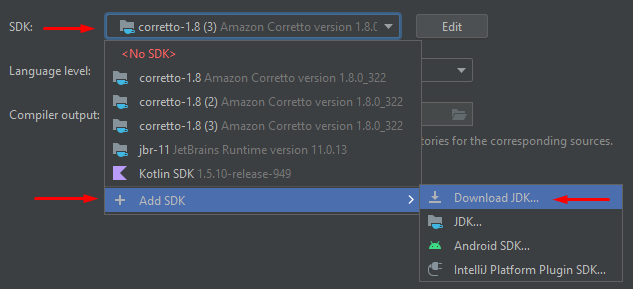

2. Kies de juiste versie en klik op "Download"
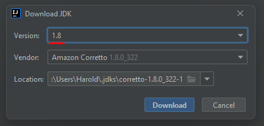

3. Zorg ervoor dat de instellingen overeen komen met de onderstaande afbeelding.
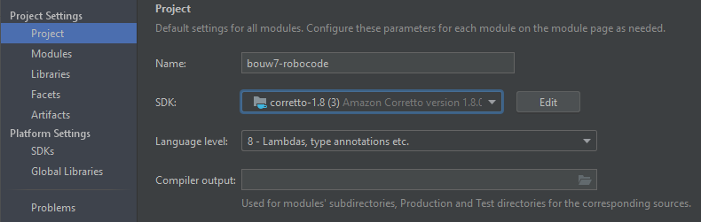

4. Klik op *Apply* en *OK*.

5. Als de "Gradle"-tool panel niet zichtbaar is, ga je naar 
   `View -> Tool windows -> Gradle`

6. In de Gradle tool panel, klik je op het "verversen"-knopje.
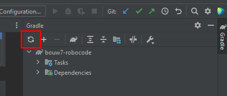

### 4. Build configuratie instellen

1. In de rechterbovenhoek van de IDE, klik je op `Add Configuration...`.
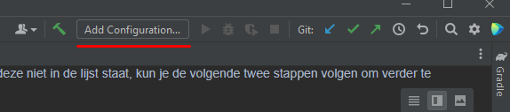

2. In het volgende venster wat opent, klik je op `Add new` en selecteer je `Application`.

3. Neem de instellingen _precies_ over zoals aangegeven op de onderstaande afbeelding.
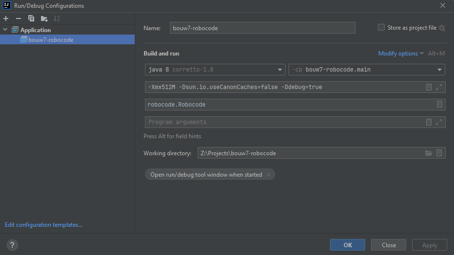

TIP: Klik op `Modify options` om "Add VM options" en "Use classpath of module"
aan te zetten en in te vullen.
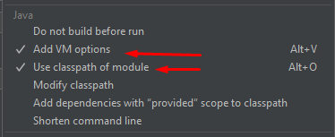

VM options (voor de luie copy-pasters onder ons):
```
-Xmx512M -Dsun.io.useCanonCaches=false -Ddebug=true
```

### 5. Builden & Starten

Als je alle vorige stappen goed hebt gevolgt, kun je nu op het hamertje klikken
om je project te builden en op het play-knopje om robocode te starten.

Voordat je je robot kunt testen, moeten we _in robocode_ nog één instelling
aanpassen.

1. Bouw je project door op het groene hamertje te klikken in de rechterbovenhoek
van je scherm.
2. Als je build successvol is verlopen, klik je op het groene pijltje om
robocode te starten.

Als alles goed is gegaan, zie je het volgende scherm:
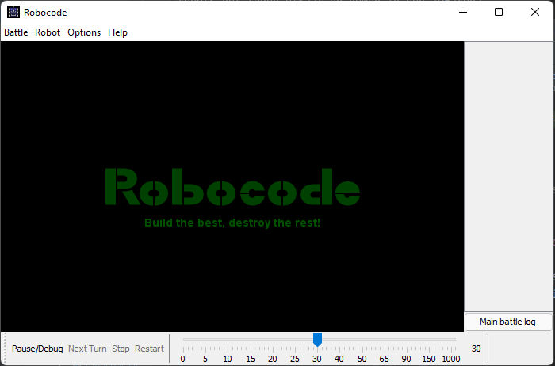

Om er voor te zorgen dat robocode je eigen robots herkent, moeten we 3 paden
toevoegen aan de instellingen.

1. Klik op `Options -> Preferences`
2. Ga naar het tabblad `Development Options` en voeg daar de volgende paden
toe, relatief aan je project:

```
build/classes/java/main
build/classes/kotlin/main
```

Het scherm ziet er vervolgens zo uit:
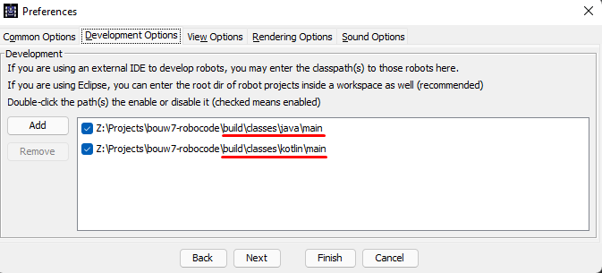

### 6. Let the games begin!

1. Vanuit Robocode, ga je naar `Battle -> New`.
2. Klik in de linker kolom onder `Packages` op `org.bouw7`.
3. Selecteer je robot en klik op `Add ->`.

Voeg minimaal 2 robots toe aan de lijst en klik op `Start battle`.

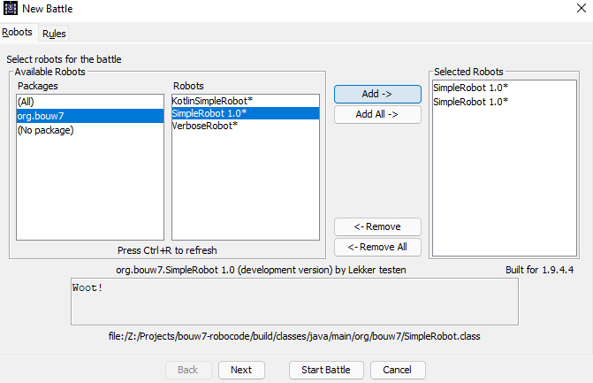

Zodra het spel is gestart, kun je wijzigingen aanbrengen aan je robot class en
door op het groene hamertje te klikken je code opnieuw compilen. Klik, terwijl
robocode nog draait, simpelweg op `Restart`, en robocode zal je robot opnieuw
inladen en het spelletje herstarten.

Vanaf dit moment kun je heel snel wijzigingen aanbrengen en testen, totdat je
een onverslaanbare robot hebt gemaakt!

## 3. Tournament

Om de avond interessant te maken laten we **één** robot van iedereen tegen
elkaar vechten. Heb je er inmiddels meerdere gemaakt? Kies er dan **één** waar
je het meeste vertrouwen in hebt om deel te laten nemen aan het tournament.

### Deelnemen

1. Klik _in robocode_ op `Robot -> Package robot or team`.
2. Selecteer **één** robot om in te pakken. 
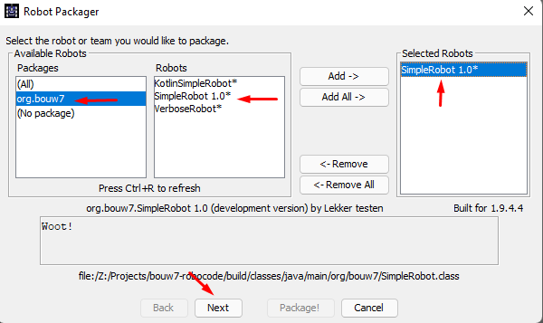
3. Klik op `Next`
4. Vul een korte omschrijving en je naam in.
5. Klik op `Next` en uiteindelijk op `Package!` om je robot in te pakken.
6. Stuur de `jar`-file van je robot naar Harold op slack.

> **LET OP**: Zorg ervoor dat je eigen naam verwerkt is in de _class name_ van je Robot class.
> Als je eigen naam er niet in is verwerkt, is er geen deelname! Zie toelichting onder "Identificatie"
> in onderstaande tekst.

### Spelregels

#### Identificatie
De robot die mee doet aan het tournament moet identificeerbaar zijn zodat
iedereen weet dat jij de auteur bent. De naam van je robot wordt herleid
uit de class naam van je robot.

Je mag een nickname gebruiken, zolang je je eigen naam er ook in verwerkt.
Bijvoorbeeld:

- `Harold` (toegestaan)
- `SpinB0tz` (niet toegestaan)
- `SpinB0tz_Harold` (toegestaan)
- `Harold_Panserfaust4000` (toegestaan)

Een afkorting van je naam mag. Het belangrijkste is dat je deelnemende robot
terug te herleiden is aan jou terwijl men naar het scherm zit te kijken.

Voorbeeld:
```java
package org.bouw7;

import robocode.Robot;
import java.awt.*;

public class SpinB0tz_Harold extends Robot {
    
    public void run() {
        // ...
    }
    
}
```

#### Regels
1. Maak je eigen robot. Geen copy-paste/clone van bestaande robots.
2. Je mag met één robot deelnemen. Je kunt lokaal meer dan één maken om te
experimenteren, maar je mag maar één indienen om mee te doen aan het tournament.
3. Samen overleggen is toegestaan om te leren, maar je deelnemende robot
moet door jezelf zijn ontwikkeld. Je wilt toch niet dat je tegenstanders jouw
code kennen om je te kunnen verslaan?
4. Verwerk je eigen voornaam in de naam van je Robot-class.
5. Je robot-class extenden van `JuniorRobot` of `AdvancedRobot` of `RateControlRobot` is _toegestaan_.

Veel plezier!

### Informatie

- Wiki: https://robowiki.net/wiki/Robocode/My_First_Robot
- API: https://robocode.sourceforge.io/docs/robocode/

Robot types:
- [JuniorRobot](https://robocode.sourceforge.io/docs/robocode/robocode/JuniorRobot.html)
- [Robot](https://robocode.sourceforge.io/docs/robocode/robocode/Robot.html)
- [AdvancedRobot](https://robocode.sourceforge.io/docs/robocode/robocode/AdvancedRobot.html)
- [RateControlRobot](https://robocode.sourceforge.io/docs/robocode/robocode/RateControlRobot.html)
